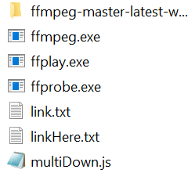

# Download Tool

A tool designed to help download "view-only" videos, particularly from SharePoint or similar platforms. This tool uses `ffmpeg` in combination with JavaScript automation.

## 📦 Features

- Automatically processes video URLs
- Integrates with `ffmpeg` for download
- Based on community-discovered techniques
- Simple text-based input (via `linkHere.txt`)

## 🧰 Prerequisites

1. Download and install [ffmpeg](https://ffmpeg.org/download.html)
2. Copy the 3 executable files into the same directory as the project (refer to `demonstration.PNG`)
3. Add the path of `ffmpeg` to your system environment variables

## 📂 File Structure

- `multiDown.js`: Main JavaScript script
- `linkHere.txt`: Paste video download links here
- `demonstration.PNG`: Shows how to set up `.exe` files
- `README.md`: Project instructions

## 🚀 Usage

1. Prepare the environment as described above
2. Add video links to `linkHere.txt`
3. Run the script (`multiDown.js`) using Node.js:
   ```bash
   node multiDown.js
   ```

4. The tool will process each link and initiate the download via `ffmpeg`.

## 📖 Reference

This tool is inspired by a technique shared on Reddit:
[Reddit: How to download view-only SharePoint videos](https://www.reddit.com/r/sharepoint/comments/nuk8q0/is_there_any_way_to_download_view_only_videos/)

> **Note:** Please use this tool responsibly and only for content you are authorized to download.

## 📸 Screenshot



## 📝 License

This project is provided as-is, without warranty. Use at your own risk.
